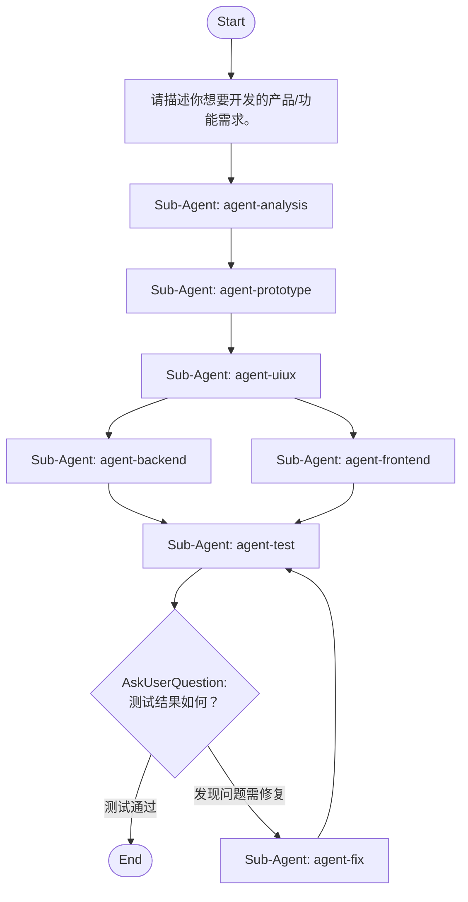

## Workflow Execution Guide

Follow the Mermaid flowchart above to execute the workflow. Each node type has specific execution methods as described below.

### Execution Methods by Node Type

- **Rectangle nodes (Sub-Agent: ...)**: Execute Sub-Agents
- **Diamond nodes (AskUserQuestion:...)**: Use the AskUserQuestion tool to prompt the user and branch based on their response
- **Diamond nodes (Branch/Switch:...)**: Automatically branch based on the results of previous processing (see details section)
- **Rectangle nodes (Prompt nodes)**: Execute the prompts described in the details section below

## Sub-Agent Node Details

#### agent-analysis(Sub-Agent: agent-analysis)

**subagent_type**: plan

**Description**: 需求分析

**Prompt**:

```
基于用户输入的需求，进行需求分析。

## 任务
1. 拆解用户需求，明确目标用户、使用场景
2. 列出核心功能点和优先级
3. 识别边界条件和非功能性需求（性能、安全、兼容性等）
4. 指出需求中不明确或需要确认的部分

## 输出格式
**目标用户与场景**
- ...

**核心功能点（按优先级）**
1. ...

**边界与非功能性需求**
- ...

**待确认问题**
- ...（如无则写"无"）
```

**Parallel Execution**: enabled

When executing this node, assess whether the task involves multiple independent areas or concerns.
If so, launch multiple agents of the same subagent_type in parallel — one per independent area.

Guidelines:
- Single area of concern → execute with 1 agent
- Multiple independent areas → spawn 1 agent per area, execute in parallel
- Wait for all agents to complete before proceeding to the next node
- Consolidate all agent results before passing to the next node

#### agent-prototype(Sub-Agent: agent-prototype)

**subagent_type**: general-purpose

**Description**: 生成产品原型

**Prompt**:

```
基于需求分析结果，生成产品原型。

## 任务
1. 设计核心页面/流程结构（信息架构）
2. 描述每个页面的主要模块和交互入口
3. 输出产品原型说明文档（可用文字+ASCII线框图描述，无需高保真视觉稿）

## 输出格式
**页面/流程结构**
- 页面名：作用说明

**关键交互流程**
1. ...

**原型说明**
（每个页面的线框结构与核心元素）
```

**Parallel Execution**: enabled

When executing this node, assess whether the task involves multiple independent areas or concerns.
If so, launch multiple agents of the same subagent_type in parallel — one per independent area.

Guidelines:
- Single area of concern → execute with 1 agent
- Multiple independent areas → spawn 1 agent per area, execute in parallel
- Wait for all agents to complete before proceeding to the next node
- Consolidate all agent results before passing to the next node

#### agent-uiux(Sub-Agent: agent-uiux)

**subagent_type**: general-purpose

**Description**: 生成UI和交互设计

**Prompt**:

```
基于产品原型，输出UI视觉与交互设计方案。

## 任务
1. 确定视觉风格（配色、字体、组件风格）
2. 设计关键页面的UI细节（布局、组件、状态）
3. 定义关键交互细节（动效、反馈、异常状态展示）
4. 如项目已有设计系统/组件库，优先复用

## 输出格式
**视觉风格**
- ...

**页面UI细节**
- 页面名：布局与组件说明

**交互细节**
- 操作：交互反馈说明
```

**Parallel Execution**: enabled

When executing this node, assess whether the task involves multiple independent areas or concerns.
If so, launch multiple agents of the same subagent_type in parallel — one per independent area.

Guidelines:
- Single area of concern → execute with 1 agent
- Multiple independent areas → spawn 1 agent per area, execute in parallel
- Wait for all agents to complete before proceeding to the next node
- Consolidate all agent results before passing to the next node

#### agent-backend(Sub-Agent: agent-backend)

**subagent_type**: general-purpose

**Description**: 构建后端项目

**Prompt**:

```
基于需求分析与设计方案，构建后端项目。

## 任务
1. 设计数据模型与API接口
2. 搭建项目结构，实现核心业务逻辑
3. 编写必要的接口文档说明
4. 遵循项目已有代码风格和架构规则，不引入不必要的新依赖

## 输出格式
**API接口列表**
- 方法 路径：作用

**数据模型**
- 模型名：字段说明

**已创建/修改文件**
- `path/to/file` — 说明
```

**Parallel Execution**: enabled

When executing this node, assess whether the task involves multiple independent areas or concerns.
If so, launch multiple agents of the same subagent_type in parallel — one per independent area.

Guidelines:
- Single area of concern → execute with 1 agent
- Multiple independent areas → spawn 1 agent per area, execute in parallel
- Wait for all agents to complete before proceeding to the next node
- Consolidate all agent results before passing to the next node

#### agent-frontend(Sub-Agent: agent-frontend)

**subagent_type**: general-purpose

**Description**: 构建前端项目

**Prompt**:

```
基于UI/交互设计，构建前端项目。

## 任务
1. 搭建页面结构，实现核心交互
2. 预留与后端API的对接接口（后端项目并行构建，接口以约定的设计为准）
3. 实现UI设计中定义的视觉与交互细节
4. 遵循项目已有代码风格，不引入不必要的新依赖

## 输出格式
**已实现页面**
- 页面名：功能说明

**API对接情况**
- 接口：对接状态

**已创建/修改文件**
- `path/to/file` — 说明
```

**Parallel Execution**: enabled

When executing this node, assess whether the task involves multiple independent areas or concerns.
If so, launch multiple agents of the same subagent_type in parallel — one per independent area.

Guidelines:
- Single area of concern → execute with 1 agent
- Multiple independent areas → spawn 1 agent per area, execute in parallel
- Wait for all agents to complete before proceeding to the next node
- Consolidate all agent results before passing to the next node

#### agent-test(Sub-Agent: agent-test)

**subagent_type**: general-purpose

**Description**: 测试构建项目

**Prompt**:

```
对已构建的前后端项目进行测试验证（前后端并行构建完成后，在此汇合并联调测试）。

## 任务
1. 启动/构建项目，检查前后端是否能正常联调
2. 运行已有测试套件（如有）
3. 手动检查核心功能流程是否符合需求
4. 记录发现的所有问题（报错、功能缺失、交互不符等）

## 输出格式
**构建/启动结果**
- 通过 / 失败：说明

**测试结果**
- 测试项：通过/失败

**发现的问题**
- 问题描述（含文件/位置，如适用）
（如无问题则写"无"）
```

**Parallel Execution**: enabled

When executing this node, assess whether the task involves multiple independent areas or concerns.
If so, launch multiple agents of the same subagent_type in parallel — one per independent area.

Guidelines:
- Single area of concern → execute with 1 agent
- Multiple independent areas → spawn 1 agent per area, execute in parallel
- Wait for all agents to complete before proceeding to the next node
- Consolidate all agent results before passing to the next node

#### agent-fix(Sub-Agent: agent-fix)

**subagent_type**: general-purpose

**Description**: 修复发现的问题

**Prompt**:

```
根据测试中发现的问题，进行修复。

## 任务
1. 逐一分析测试报告中的问题
2. 定位问题代码并实施修复
3. 修复后重新运行相关测试/构建检查
4. 总结本轮修复内容

## 输出格式
**问题与修复对照**
- 问题：修复方式

**已修改文件**
- `path/to/file` — 修改说明

修复完成后将返回测试步骤重新验证。
```

**Parallel Execution**: enabled

When executing this node, assess whether the task involves multiple independent areas or concerns.
If so, launch multiple agents of the same subagent_type in parallel — one per independent area.

Guidelines:
- Single area of concern → execute with 1 agent
- Multiple independent areas → spawn 1 agent per area, execute in parallel
- Wait for all agents to complete before proceeding to the next node
- Consolidate all agent results before passing to the next node

### Prompt Node Details

#### prompt-input(请描述你想要开发的产品/功能需求。)

```
请描述你想要开发的产品/功能需求。

请尽量包含：
- 目标用户和使用场景
- 核心功能点
- 期望达到的效果

输入完成后将进入需求分析阶段。
```

**Available variables:**
- `{{requirement}}`: (not set)

### AskUserQuestion Node Details

Ask the user and proceed based on their choice.

#### ask-test-result(测试结果如何？)

**Selection mode:** Single Select (branches based on the selected option)

**Options:**
- **测试通过**: 项目构建和功能测试均通过，无需修复。
- **发现问题需修复**: 测试中发现问题，需要进入修复流程。
