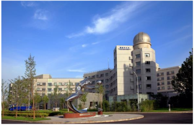

![ref1]

**Created with an evaluation copy of Aspose.Words. To remove all limitations, you can use Free Temporary License [**https://products.aspose.com/words/temporary-license/**](https://products.aspose.com/words/temporary-license/)**

中国科学院国家天文台 **2023** 年部门预算** 

目     录 

[一、中国科学院国家天文台基本情况 ..................................... 1 ](#_page3_x87.00_y72.92)

[（一）单位职责 .................................................................... 1 ](#_page3_x87.00_y107.92)

[（二）机构设置 .................................................................... 2 ](#_page4_x87.00_y72.92)[二、中国科学院国家天文台 2023 年部门预算 ....................... 3 ](#_page5_x87.00_y72.92)

[收支总表 ................................................................................ 4 ](#_page6_x87.00_y72.92)

[关于收支总表的说明 ............................................................ 5 ](#_page7_x87.00_y72.92)

[收入总表 ................................................................................ 6 ](#_page8_x69.00_y122.32)

[关于收入总表的说明 ............................................................ 7 ](#_page9_x87.00_y84.92)

[支出总表 ................................................................................ 8 ](#_page10_x87.00_y72.92)

[关于支出总表的说明 ............................................................ 9 ](#_page11_x87.00_y72.92)

[财政拨款收支总表 .............................................................. 10 ](#_page12_x87.00_y72.92)

[关于财政拨款收支总表的说明 .......................................... 11 ](#_page13_x87.00_y72.92)

[一般公共预算支出表 .......................................................... 12 ](#_page14_x87.00_y72.92)

[关于一般公共预算支出表的说明 ...................................... 13 ](#_page15_x87.00_y72.92)

[一般公共预算基本支出表 .................................................. 14 ](#_page16_x69.00_y90.32)

[关于一般公共预算基本支出表的说明 .............................. 16 ](#_page18_x87.00_y72.92)

[一般公共预算“三公”经费支出表 ...................................... 17 ](#_page19_x69.00_y90.32)

[关于一般公共预算“三公”经费支出表的说明 .................. 18 ](#_page20_x69.00_y53.92)

[政府性基金收支表 .............................................................. 19 ](#_page21_x69.00_y53.92)

[国有资本经营预算支出表 .................................................. 20 ](#_page22_x69.00_y53.92)[三、其他事项说明 ................................................................... 21 ](#_page23_x127.00_y72.92)

**Evaluation Only. Created with Aspose.Words. Copyright 2003-2026 Aspose Pty Ltd.**
![ref2]

[（一）政府采购情况说明 .................................................. 21 ](#_page23_x87.00_y108.92)

[（二）国有资产占有使用情况说明 .................................. 21 ](#_page23_x87.00_y240.92)

[（三）预算绩效情况说明 .................................................. 21 ](#_page23_x87.00_y494.92)[四、名词解释............................................................................ 22 ](#_page24_x87.00_y72.92)

[（一）收入科目 .................................................................. 22 ](#_page24_x87.00_y108.92)

[（二）支出科目 .................................................................. 22 ](#_page24_x87.00_y474.92)[附表：中国科学院国家天文台项目预算绩效目标表 ........... 25 ](#_page27_x87.00_y72.92)

**Evaluation Only. Created with Aspose.Words. Copyright 2003-2026 Aspose Pty Ltd.**
![ref3]

一、中国科学院国家天文台基本情况 ****（一）单位职责** 

中国科学院国家天文台是中国科学院直属事业单位，成 立于 2001 年 4 月，系由中国科学院天文领域原两台一所两 站整合而成。 

中国科学院国家天文台发展目标是：建设成为集天文学 基础前沿研究、天文技术方法创新应用、地基与空间重大天 文观测装置建造运行、国家月球与深空探测科学应用和空间 碎片监测与应用等“四位一体”的、世界一流水平的综合性国 家天文研究机构，引领中国天文事业实现新的跨越，为加快 实现国家高水平科技自立自强做出应有贡献，为人类探索宇 宙奥秘做出中国贡献。 

中国科学院国家天文台新时期办台方针是：以“出重大成 果、出优秀人才”为中心，规划好、建设好、运行好、使用好 重大观测装置和重大任务设施，积极承担并圆满完成相关领 域国家重大科技任务，不断推动天文领域重大原创成果产 出、关键核心技术突破、天文学人才高地建设和科技体制机 制改革。 

（二）机构设置** 

中国科学院国家天文台是国家航天局空间碎片监测与 应用中心、国家天文科学数据中心的依托单位，国际空间环 境服务组织中国中心主任单位；是中国科学院天文大科学研 究中心、南美天文研究中心的依托单位；是中国科学院大学 天文与空间科学学院主承办单位。 

中国科学院国家天文台本部内设有光学天文、射电天 文、星系宇宙学、太阳物理、空间科学、月球与深空探测、 应用天文等 7 个研究部，8 个管理部门和 2 个支撑部门。在 河北兴隆，北京怀柔、密云，天津武清，新疆乌拉斯台、红 柳峡、慕士塔格，西藏阿里、羊八井，青海冷湖，贵州平塘 以及阿根廷圣胡安等地建有天文观测基地或台站。 

二、中国科学院国家天文台 **2023** 年部门预算** 

2023  年是深入推进实施“十四五”战略规划、推动“十四 五”规划目标实现的关键之年，抢抓机遇争取承担国家重大科 技任务，管理运行好重大观测设施，组织做好各类科学数据 处理的应用研究工作，努力产出更多更大科学成果。 

2023 年工作总体思路是：深入学习贯彻党的二十大精 神，落实党的全面领导，落实党中央、国务院和院党组重大 决策部署，面向国家重大需求、面向国际天文科技前沿、面 向经济主战场，加快推进国家“十四五”科技发展规划实施， 加快建设和持续推进国家重点实验室重组工作，加快协同凝 聚天文领域科研队伍，加强青年人才队伍建设，加快进入高 质量发展新阶段，为创新型国家和世界科技强国建设做出更 大贡献。 

中国科学院国家天文台 2023 年初部门预算总额 198,223.16 万元。中国科学院国家天文台部门预算既包括人 员支出和机构运行支出，也包括竞争性经费、人才引进与培 养、科研条件及后勤保障、合作交流与咨询传播、科普活动、 科研设施专项运行等支出。 

收支总表** 

`    `部门公开表 1 

单位：万元 

|收**       入** |支**       出** |||
| - | - | :- | :- |
|项**     目** |预算数** |项**     目** |预算数** |
|一、一般公共预算拨款收入 |57,806.77 |一、科学技术支出 |143,981.03 |
|二、政府性基金预算拨款收入 ||二、社会保障和就业支出 |1,930.68 |
|三、国有资本经营预算拨款 ||三、住房保障支出 |1,314.37 |
|四、事业收入 |32,000.00 |||
|五、事业单位经营收入 ||||
|六、其他收入 |2,200.00 |||
|||||
|本年收入合计 |92,006.77 |本年支出合计 |147,226.08 |
|使用非财政拨款结余 ||结转下年 |50,997.08 |
|上年结转 |106,216.39 |||
|收  入  总  计** |**198,223.16** |支  出  总  计** |**198,223.16** |

关于收支总表的说明** 

按照部门预算编制要求，单位所有收入和支出均纳入部 门预算管理。收入包括：一般公共预算拨款收入、事业收入、 其他收入、上年结转。支出包括：科学技术支出、社会保障 和就业支出、住房保障支出。我单位 2023 年收支总预算 198,223.16 万元。 

**Evaluation Only. Created with Aspose.Words. Copyright 2003-2026 Aspose Pty Ltd.**

5 
![ref4]

收入总表** 

部门公开表 2 

单位：万元 

|合计** |上年结转** |一般公共预算 拨款收入** |政府性基金预 算拨款收入** |国有资本 经营预算 拨款收入** |事业收入** |事业单位** 经营收入** |上级补助 收入** |附属单位** 上缴收入** |其他收入** |使用非财政 拨款结余** ||
| - | - | :-: | -: | - | - | - | :-: | - | - | -: | :- |
||||||金额** |其中**:**教育 收费** ||||||
|198,223.16 |106,216.39 |57,806.77 |||32,000.00 |||||2,200.00 ||
6 

**Evaluation Only. Created with Aspose.Words. Copyright 2003-2026 Aspose Pty Ltd.**

![ref5]关于收入总表的说明** 

2023 年初，我单位收入总计 198,223.16 万元。其中，一 般公共预算拨款收入 57,806.77 万元，占 29.16%；事业收入 32,000.00万元，占16.14%；其他收入2,200.00万元，占1.11%； 上年结转 106,216.39 万元，占 53.59%。 

**Evaluation Only. Created with Aspose.Words. Copyright 2003-2026 Aspose Pty Ltd.**

8 
![ref6]

支出总表** 

`                                                         `部门公开表 3                                                            单位：万元 

|科目编码** |科目名称** |合计** |基本支出** |项目支出** |
| - | - | - | - | - |
|206 |科学技术支出 |143,981.03 |`   `16,362.47 |`  `127,618.56 |
|20602 |`   `基础研究 |`   `100,542.25 |`  `16,362.47 |84,179.78 |
|2060201 |`   `机构运行 |16,362.47 |`  `16,362.47 |- |
|2060203 |`   `自然科学基金 |6,000.00 |- |6,000.00 |
|2060205 |`   `重大科学工程 |16,158.00 |- |16,158.00 |
|2060206 |`   `专项基础科研 |`   `14,359.75 |- |14,359.75 |
|2060299 |`   `其他基础研究支出 |`   `47,662.03 |- |`  `47,662.03 |
|20603 |`   `应用研究 |`  `19,053.95 |- ||

**This document was truncated here because it was created in the Evaluation Mode.**
**Evaluation Only. Created with Aspose.Words. Copyright 2003-2026 Aspose Pty Ltd.**

[ref1]: sample.001.png
[ref2]: sample.004.png
[ref3]: sample.005.png
[ref4]: sample.006.png
[ref5]: sample.007.png
[ref6]: sample.008.png
